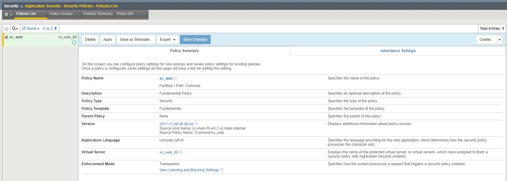
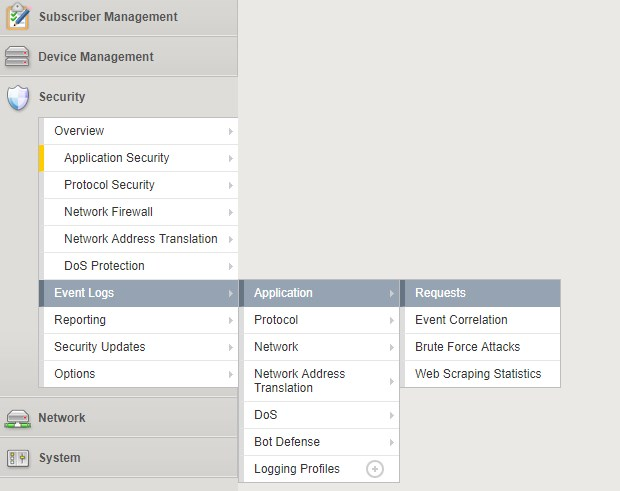

# F5設定ASM(WAF)

### 建立一個security policies (前提之下要先建好vistual server)

### 輸入NAME 和選擇VS security policies (vs_web_80)

### 建立完成畫面 

### 一開始選擇你要使用的模式 transparent 是學習模式，等學習完畢之後再來使用blocking模式。下方紅框可以針對所需要的進行設定

### 在ASM裡的設定調整之後按完save，之後還需要按Apply policy 才會成功生效

### 設定完畢後可以看到 白色空心盾牌表示穿透，是transparent學習模式。藍色實心盾牌表示阻擋，是blocking阻擋模式

### *其他相關防護設定*
###  IP Address Exceptions 可以設定ip，僅允許此ip連入的都進行學習模式

###  Geolocation Enforcement可以設定需讓哪些國家可以連，哪些國不能連

### 在vs的security\policies下的log profile可以設定需要查看哪種，從右邊選到左邊即可。
### log all requests=> 記錄所有的請求log
### log illegal requests => 記錄不合法的請求log

### 在traffic learning下 會學習到100%會自動納入規則裡，如果已確認此項目(行為)是正常的話，可以不需要等到100%，可以直接按 accept suggestion即會自動納入規則。

### 查詢eventlog 「預設」會使用illegal request，如果需要查看全部log的話需要將它關掉

### 出現的紅色禁止符號(紅框)，表示非法請求被擋下，出現紅色旗子(綠框)，表示非法請求但未達到阻擋條件

### 剛開始設定學習模式，在不同的規則下(紅框)每一個進去都會是 * (綠框)。等學習模式結束後，開始進行阻擋之後，這個* 通通都要刪掉，否則會變成不阻擋

### 查看ASM學習之後的log：Security  ››  Event Logs : Application : Requests

### ★提醒 DOS protection 可針對1對1的攻擊保護，但因角子都進LB來源IP皆為LB，會發生誤檔的情況，因此不需要開此功能

### 範例 在學習模式下進行的行為

### ASM的調整記錄會顯示在Security  ››  Application Security : Policy : History

