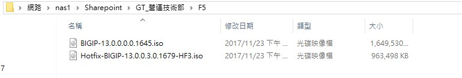
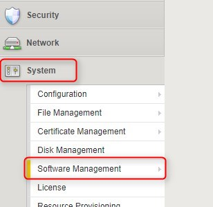
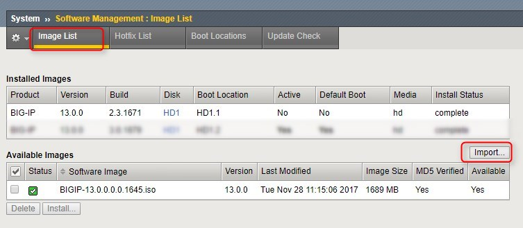
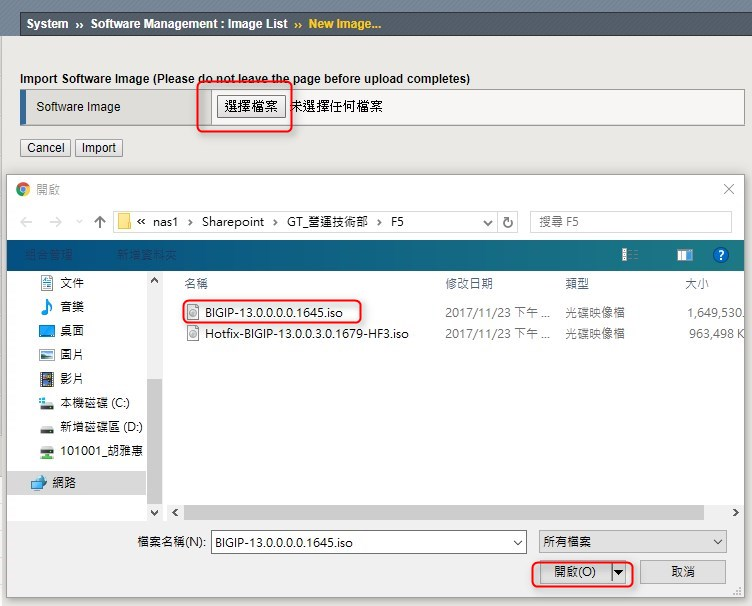
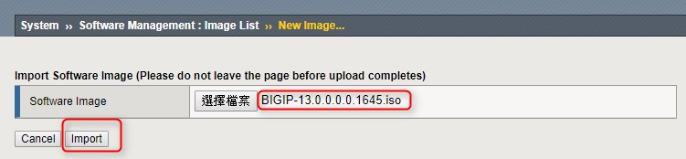
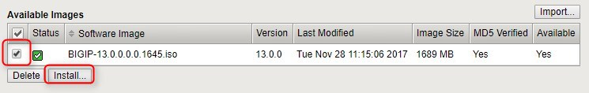
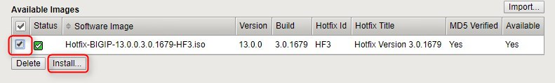
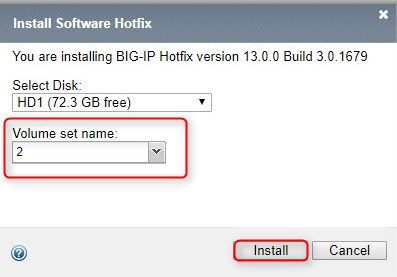
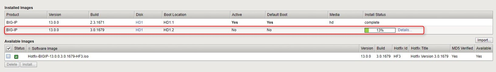
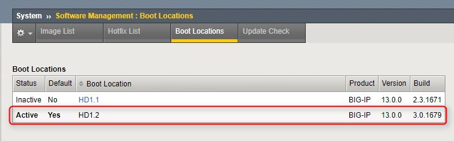

# F5系統更新
### 需要有檔案憲哥會放置\\nas1\Sharepoint\GT_營運技術部\F5

### 開啟F5畫面，選擇system \ software management

### 需要匯入image list和Hotfix list的iso檔，右邊按import

### 選擇image檔案 BIGIP-13.0.0.0.0.****.iso，然後按開啟，再按import

### 選擇hotfix list 右邊按import，選擇Hotfix-BIGIP-13.0.0.3.0.****-HF3.iso，import (步驟同上image list)

### image list和Hotfix list的iso檔 打勾，按，按下install

### volume set name 輸入另一個名稱，EX：2，按insatll

### boot locations 點選 HD1.2
Boot Location	HD1.1 >> HD1.2

Install Configuration	選擇 YES

按activate

### 系統更新完成畫面

