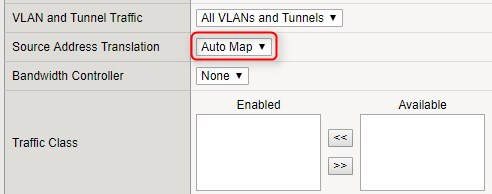

### sc架構：客端-lb-f5-vs-pool-node-web01~04

### 要使用F5 需設定node→pool→virtual servers

# 一、登入F5
### https://f5.live.bvcasino.info:8443

# 建立node 
### local traffic 選 nodes -> 右上create 


### 建立WEB01~04，設定完按finish，下圖以WEB01為例 


### nodes設定完成畫面 


# 二、建立pool 
### 建立 web使用的pool -> 右上create 

### 輸入name、health monitors、load balancing method

### New Member選擇 node list 即會出現剛才新增的node選項，輸入address、port、add加入後，按finished

### pool設定完成畫面，status為綠色


# 三、建立virtual servers (需建立http與https二種)
## 1.建立 http使用的virtual servers -> 右上create 

### 輸入name(vs_web_80)、source address(任何人皆可連線)、destination address/mark 則要輸入此台f5的內網ip

### source address translation(SAT) 要選擇 automap

### default pool 要選擇 pool_web，按finished


## 2.建立 https使用的virtual server 
### 因HTTPS需要ssl profile(clinet) 需要到profiles先設定


### 建立 http使用的virtual servers -> 右上create 

### 輸入name(vs_web_443)、source address(任何人皆可連線)、destination address/mark 則要輸入此台f5的內網ip

### 選bravocasinossl 

### source address translation(SAT) 要選擇 automap

### default pool 要選擇 pool_web

### virtual server 設定完畢畫面

### 全部設定完畢畫面


# 四、建立gcp vm、lb
### 建立VM、建立個體群組

### 新增負載平衡，啟動設定

### 後端設定

### 建立後端服務，並設定健康狀態

###主機與路徑規格 會自動帶入

### 前端設定 HTTP


### 過一陣子後，檢查健康狀態為 0/ 1  因後端連不到LB

### 所以需要另外處理，這裡使用irules來客製化才會讓後端連到LB，因irules裡程式會使用到 http標頭，因此需到gcp的f5的健康狀態設定http標頭
###


### 到f5網頁上面設定irules -> 右上create 


```
when HTTP_REQUEST {
    set httpHost [string tolower [HTTP::host]]
    if { $httpHost equals "gcplbcheck" } {
        HTTP::respond 200
        return
    }
}
```

### 到GCP新增防火牆規則   
```
130.211.0.0/22
35.191.0.0/16
```


### 設定完畢 檢查健康狀態正確要為 1/ 1 


# 五、調整cloud DNS


# 六、測試F5 是否設定成功

### 需先在各WEB全部加入一個站台

### 測試lb http 成功導到web設備

### 因lb是需要給所有玩家連線的  所只會吃80 port, 因此443連不上，此為正常


