## GCP 匯入憑證

### 登入F5，https://f5.live.bvcasino.info:8443  
 
### MAIN, SSL Orchestrator, Certitificates and keys  
 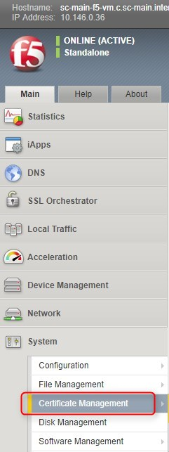

### 匯入Traffic Certificate Management憑證 選import 
 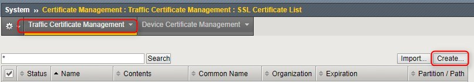
### import type：選PKCS 12 (IIS) 
 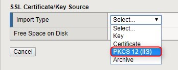
### 選擇憑證的檔案，檔案選 .pme  
 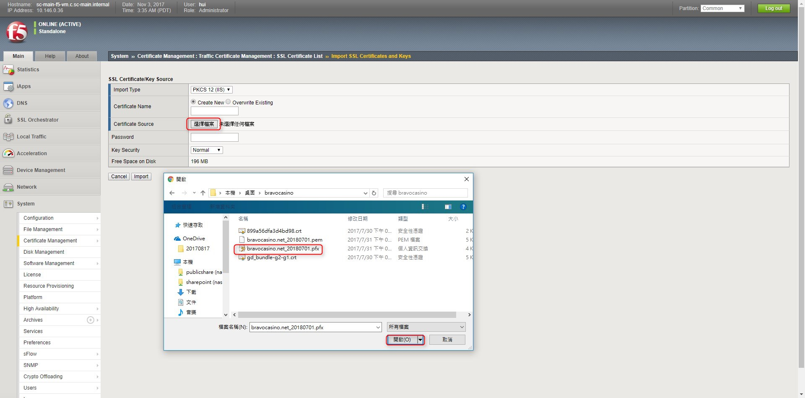
### name可自行定義，輸入密碼，按import  
 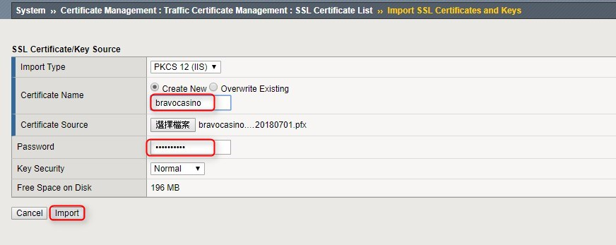
### 匯入憑證完畢畫面 

 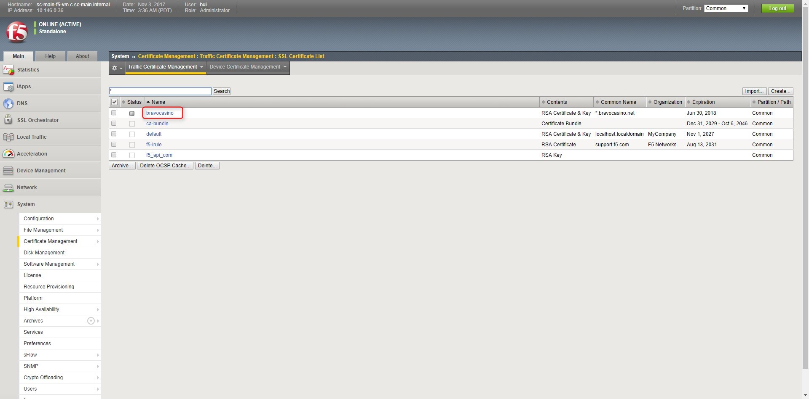
### 繼續匯入憑證，選certificate, 檔案選 .crt 
 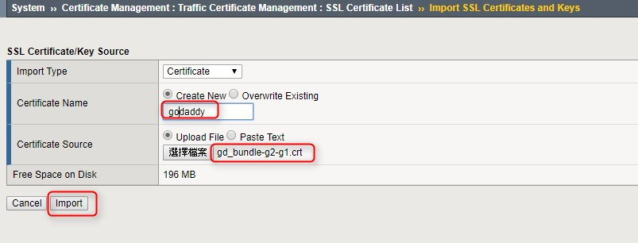
### 匯入憑證完畢畫面 
 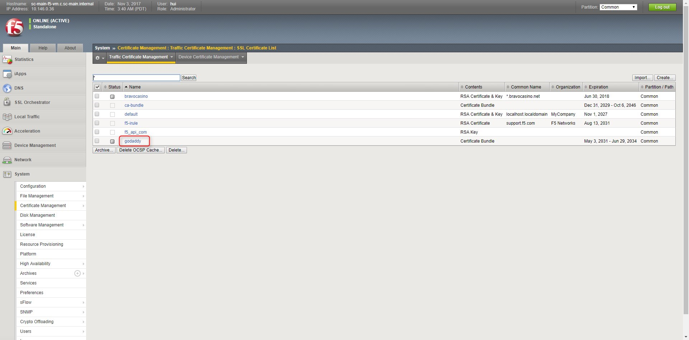

### F5的domain需使用https，因此需匯入Device Certificate Management 憑證，選擇device certificate，選擇impoart 
 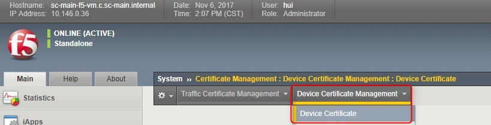
### import type：選PKCS 12 (IIS)  
 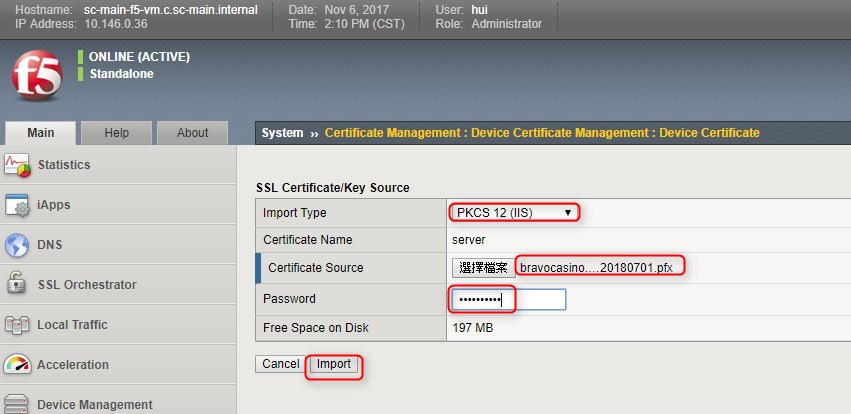
### 匯入憑證完畢畫面 
 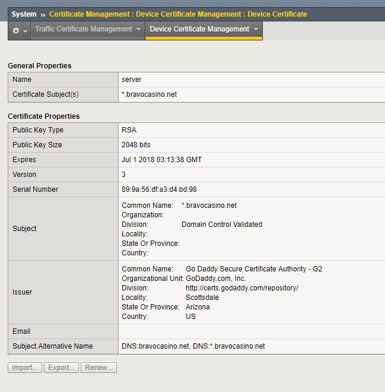