# 建立GCP雲端機器
##### 
1. [連結到Google Cloud Platform](https://cloud.google.com/?utm_source=google&utm_medium=cpc&utm_campaign=japac-TW-all-en-dr-bkws-all-super-trial-e-dr-1002234&utm_content=text-ad-none-none-DEV_c-CRE_205812821243-ADGP_BKWS%20%7C%20EXA%20~%20T1%20-%20General_M:1_TW_EN_cloud-googlecloud-KWID_43700018487811535-kwd-35920686936&userloc_9040380&utm_term=KW_googlecloud&gclid=CNnCzIrBg9UCFVgFKgod99wNLQ&dclid=COnE9orBg9UCFcUulgodL5kHxg "Google Cloud Platform")

##### 
2. 登入Google `ex. charles.wang@gosmio.biz`

##### 
3. 點擊畫面右上角`控制台`  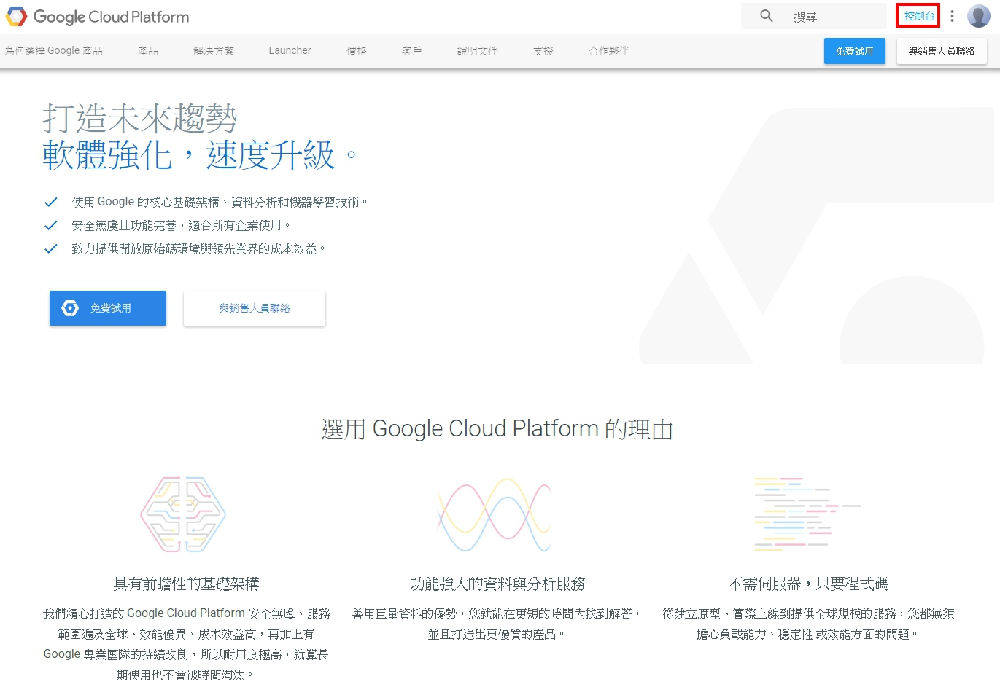

***
##### 
4. 選取或建立新機構（專案）  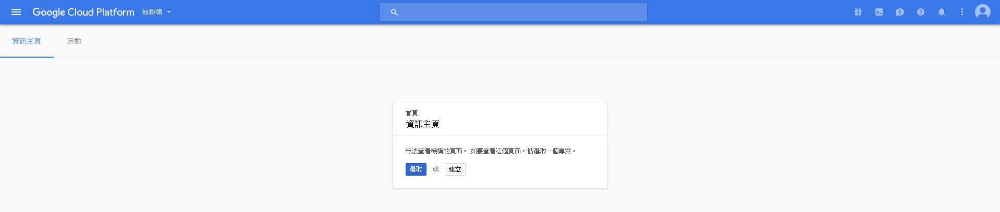

***
##### 
5. 選取gosmio.biz/`Bet666`專案   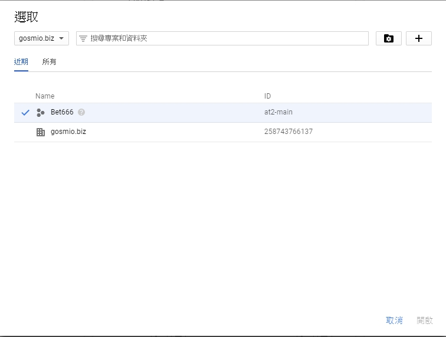 
即可看到「資訊主頁」畫面。  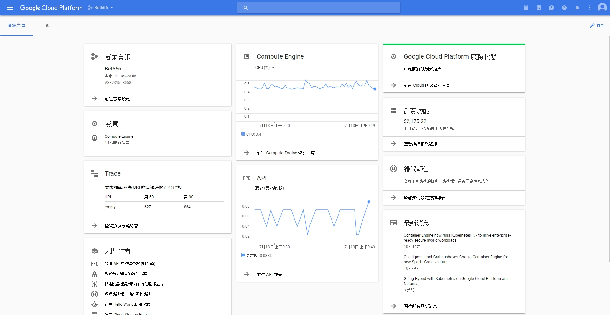

***
##### 
6. 點選`資訊主頁`畫面左上方的工具列   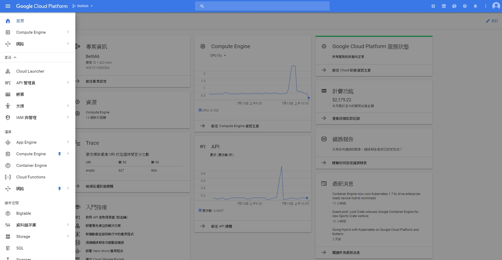
畫面左側會出現工具列清單。

***
##### 
7. 點選工具列清單→Compute Engine→`VM執行個體`   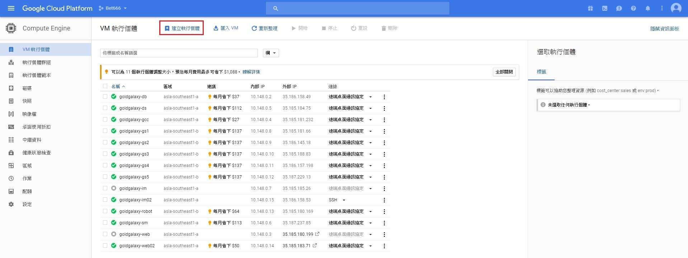 
點選`建立執行個體`。

***
##### 
8. 輸入名稱`（名稱必須為小寫字母、數字或連字號，且結尾須為小寫字母或數字）`、選擇區域與機器類型 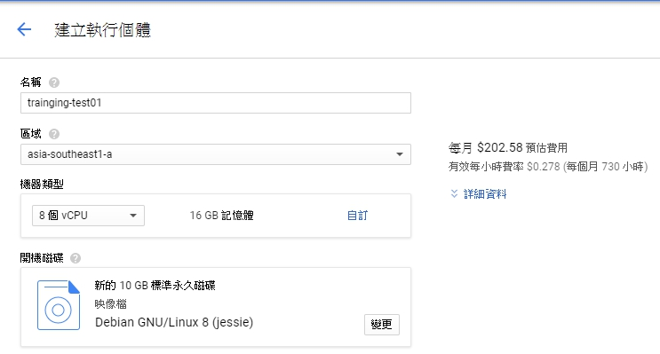 
點選`變更`，選擇作業系統與開機磁碟類型   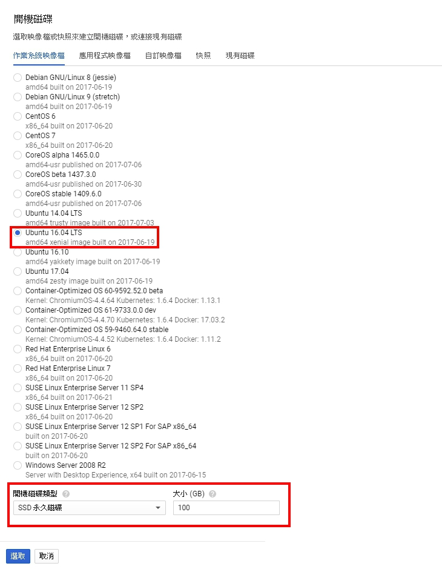  點選`選取`

***
##### 
9. 依需求變更`身分及API存取權`與`防火牆`   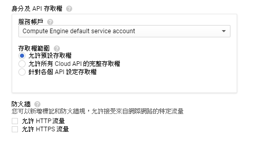

***
##### 
10. 設定`管理、磁碟、網路、SSH金鑰`   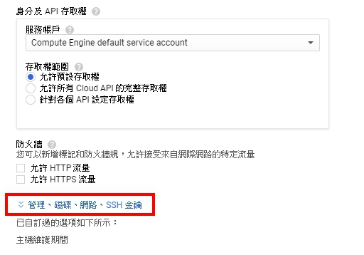 
 10.1. 設定`管理`頁籤內容   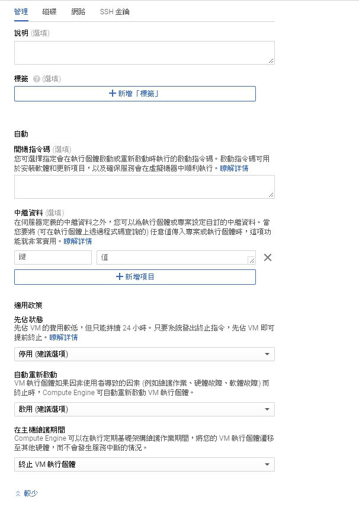   10.2. 設定`磁碟`頁籤內容（點選`＋新增項目`建立第二磁碟）   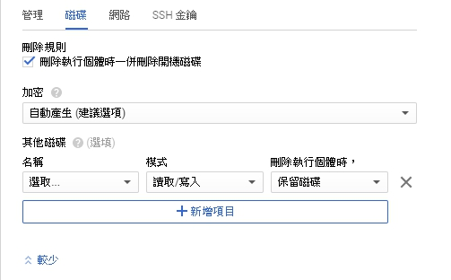   10.3. 設定`網路`頁籤內容（在`網路介面`下點選編輯）  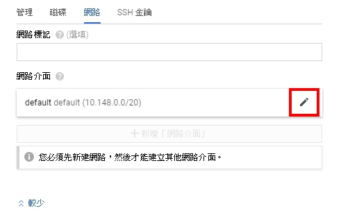   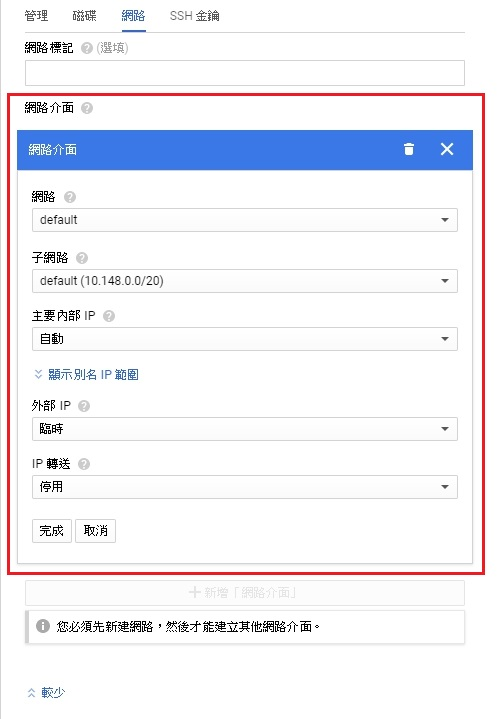   10.4. 設定`SSH金鑰`   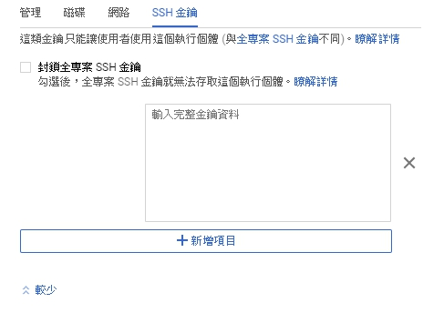 

***
##### 
11. 再次確認步驟8至步驟10的內容是否正確，確認無誤後，點選`建立`   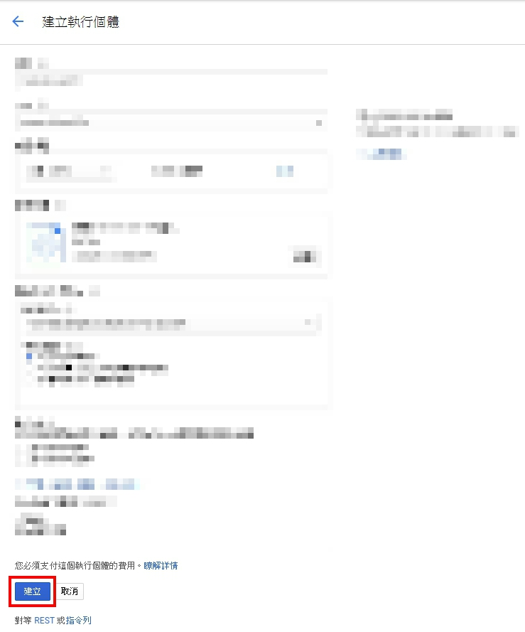

# 
完成`GCP雲端機器`建立
