## GCP建置F5

### 登入GCP後，選擇Cloud Launcher  
 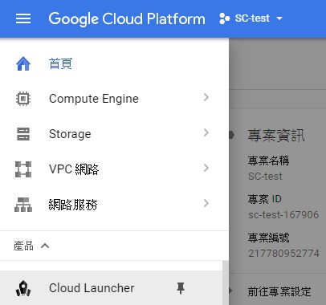
 
### 搜尋f5，選擇F5 BIG-IP ADC Best-BYOL 
 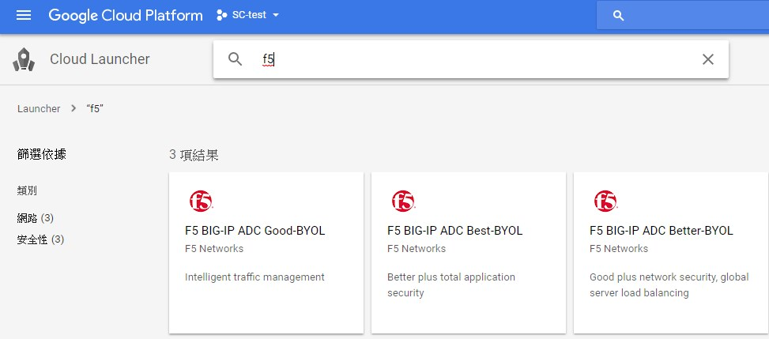
### 下方內容有說明F5各等級的差異  
 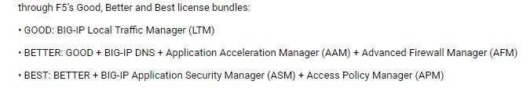
### 按COMPUTE ENGINE上啟動  
 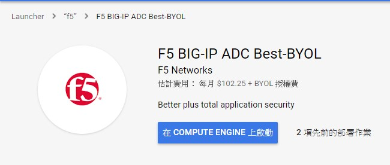
### 輸入NAME、ZONE，資源依需求調整，按部署   
 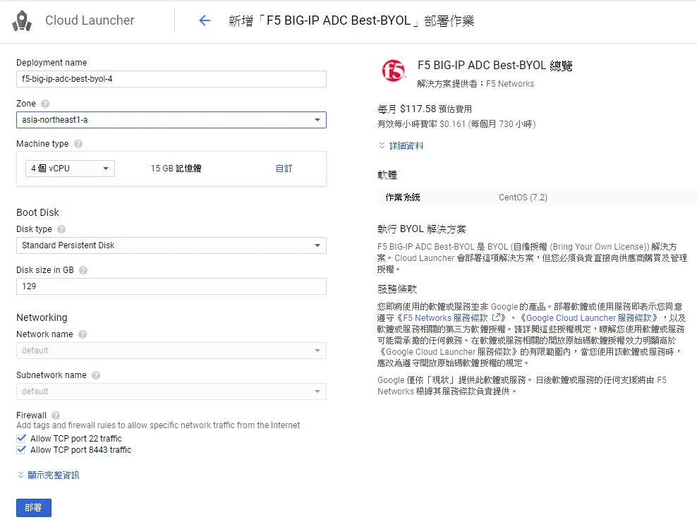
### 正在部署    
 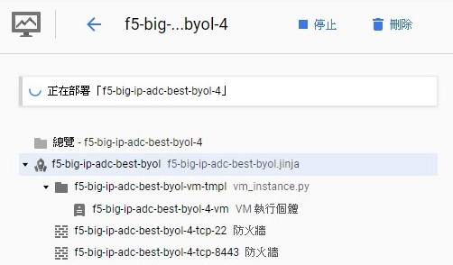
### 部署完成 
 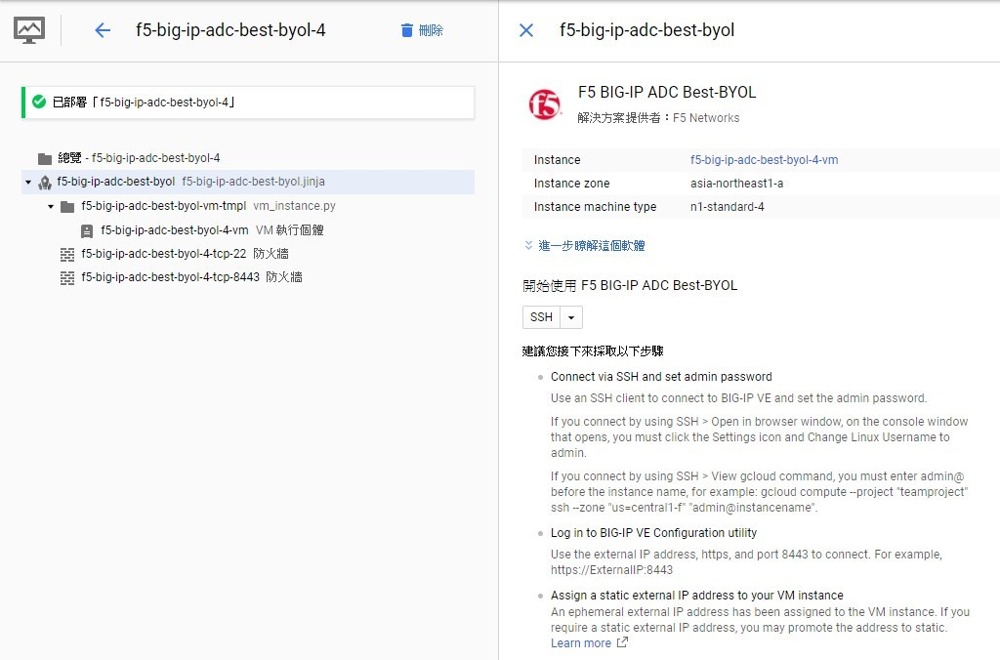
 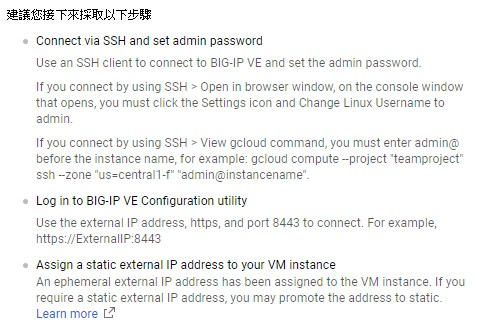

### 塑建議回到VM執行個體，查看F5的IP與是否啟動成功 
 

### 接著到VPC網路，外部IP位址，將上述的IP 類型從臨時改成「靜態」，否則重開機之後外部IP會換過。 

### 開啟xshell連線F5 IP，視各個環境狀況選擇以下方式登入   
### 1.使用admin 登入 。 
 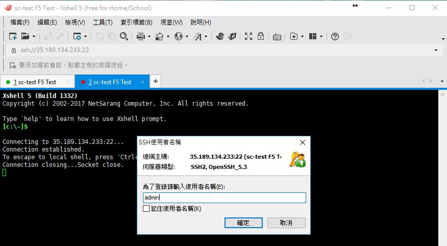
### 2.如果GCP有使用中繼資料 admin登入改密碼需使用public key(admin)  與 私人key 進行登入。 

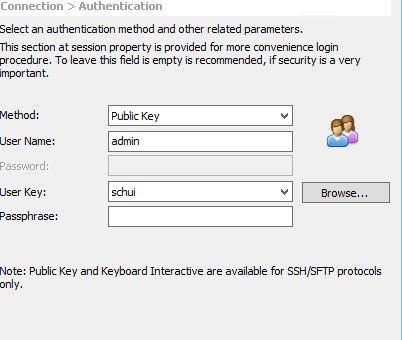
### 要更改管理員密碼，輸入modify auth password admin   
### 輸入密碼  
### 再次確認密碼  
### 確保系統保留更改密碼，請輸入save sys config  
 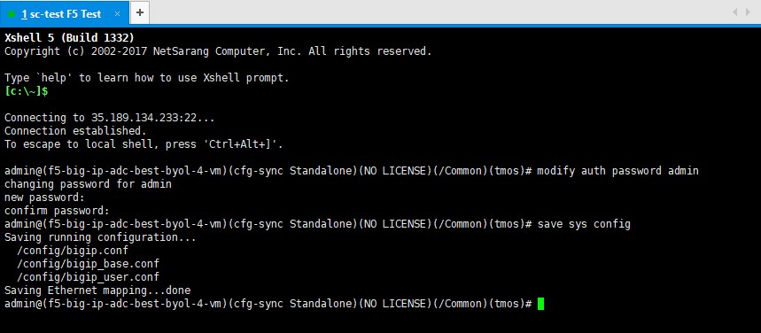
### 開啟網頁輸入https://104.198.93.133:8443 使用admin與管理員新密碼登入 
 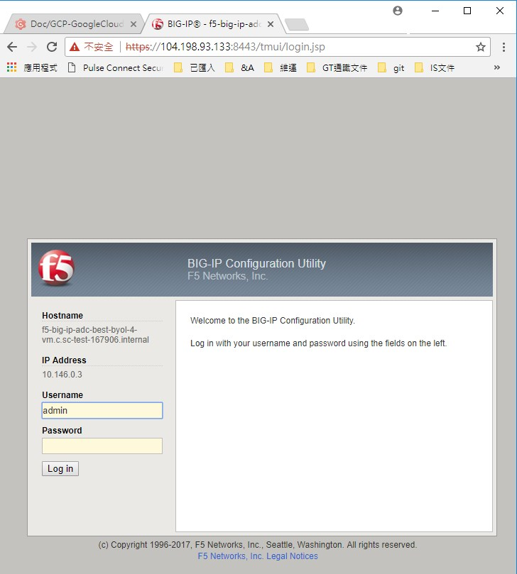
### 成功登入F5的畫面，按activate　  
 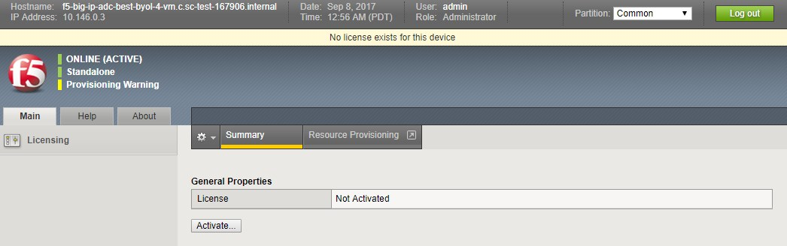
### 輸入License，選 NEXT　  
 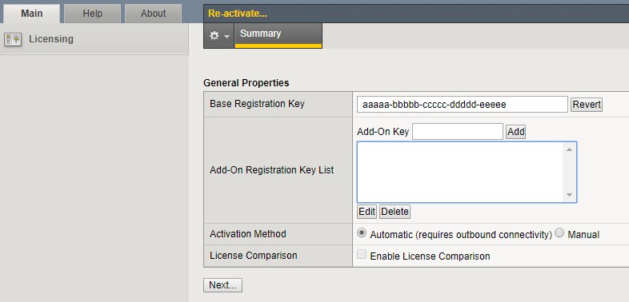
### 選 accetp　  
 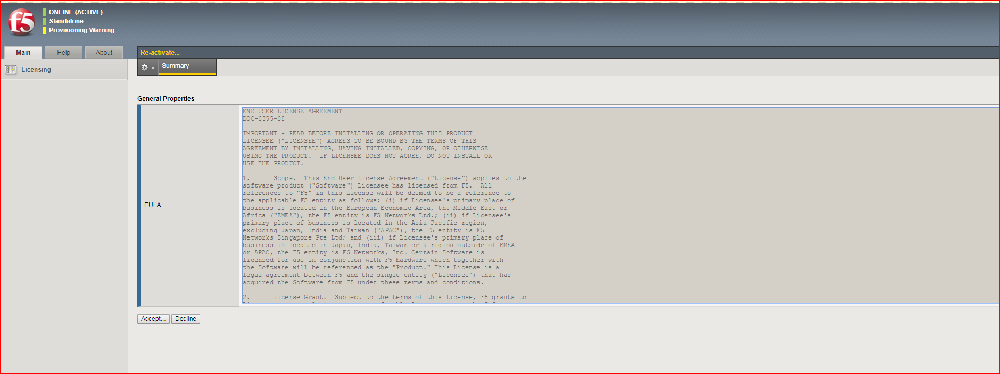
### 進行中　  
 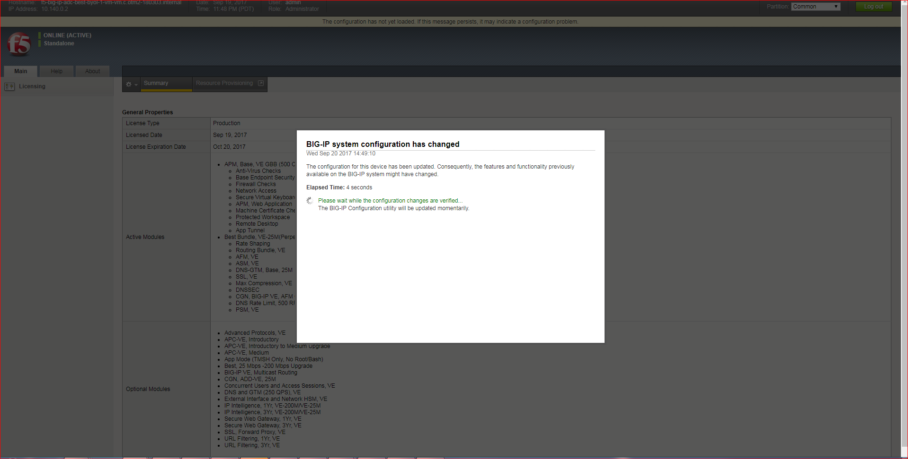
### 完畢，選CONTINUE　  
 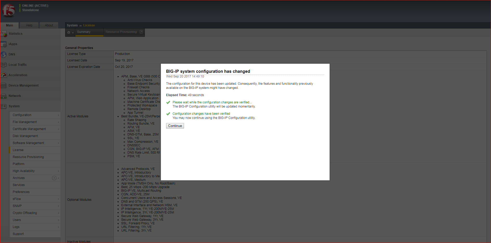
### 調整F5時區，System->Platform 改成台北時區。  
 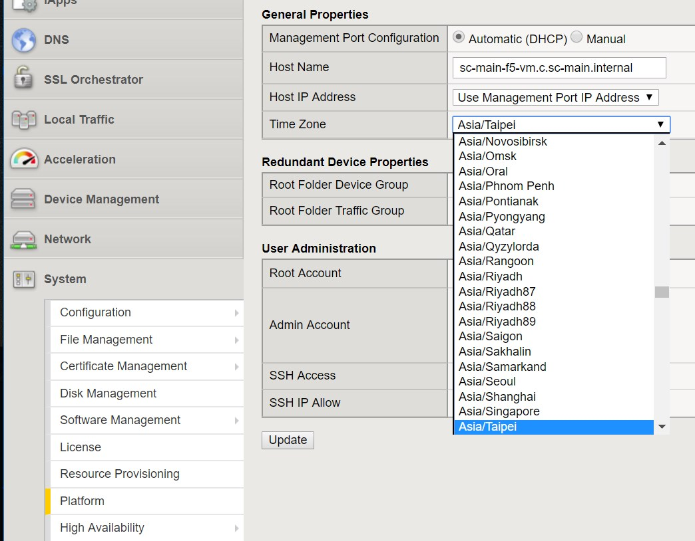
### GCP建置完會自動建好防火牆規則，22PORT不需要，8443PORT僅留維護線路IP。  
 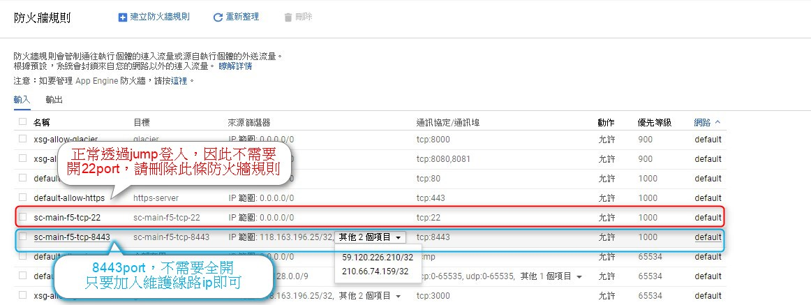

